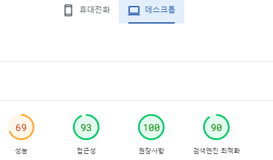
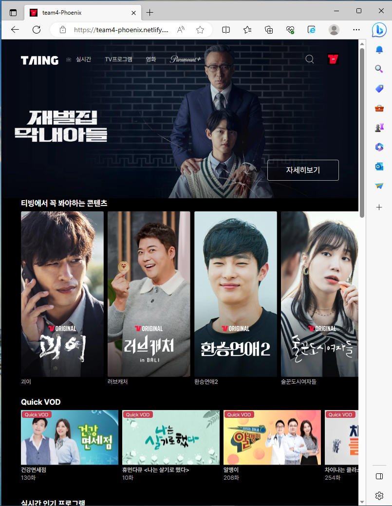

# HTML/CSS 프로젝트 팀 4조

<br>

## 배포 주소 📇

[메인페이지 주소](https://team4-phoenix.netlify.app/)
<br>
[로그인 주소](https://team4-phoenix.netlify.app/views/login.html)
<br>
[아이디 찾기 주소](https://team4-phoenix.netlify.app/views/find-id.html)
<br>
[비밀번호 찾기 주소](https://team4-phoenix.netlify.app/views/findpw.html)
<br>
[회원가입 주소](https://team4-phoenix.netlify.app/views/signup.html)


<br>

## 조이름 😃

불사조

<br>

## 팀원 소개 👩‍👩‍👧‍👦

김재희, 김진주, 전선용, 차지훈

<br>

## 기술 스택 🔨


<br>

## 주제 📝

티빙 메인페이지 모바일, 태블릿, 데스크탑 반응형으로 만들기

<br>

## 팀원 파트 🧚🏻

- 김재희 : 메인페이지 티빙에서 꼭 봐야하는 콘텐츠, Quick VOD 섹션과 아이디 찾기 페이지
- 김진주 : 메인페이지 실시간 인기 프로그램, 인기 LIVE 채널 섹션과 로그인 페이지
- 전선용 : 메인페이지 헤더, 이벤트 섹션과 비밀번호 찾기 페이지
- 차지훈 : 메인페이지 오직 티빙에만 있어요, 하단 광고 섹션, 푸터와 회원가입 페이지

<br>

## 공지 및 규칙 ⛑️

### commit 규칙

```bash
❗️commit 규칙 : “[keyword](branch name): 내용 자세히”
➡️ 띄어쓰기는 괄호사이는 띄우지 말고 ‘ : ’ 다음 한칸 띄우고 내용 작성

keyword 이름
1. 개발 : dev
2. 수정 : upd
3. 삭제 : del
```

```
❗️Markup 규칙

- branch 이름은 폴더명과 똑같이 명시
- Markup은 views 폴더에 각자 맡은 파트 이름으로 작성 (나중에 index.html에 합칠 예정)
```

```
❗️Markup 후 규칙

- Markup 작성 완료 후 유효성 검사
- PR을 통해 branch 병합 전, 코드 리뷰를 함께하기
```

```
❗️Pull Request 규칙 :

제목 - commit 내용이랑 일치

내용 - 자유롭게 자세히 작성

라벨 - [dev] : 코드 작성

      [upd] : 코드 수정

      [setting] : 환경설정 변경

      [del] : 파일 삭제
```

```
❗️네이밍 규칙:
        파일 및 이미지 이름 : 케밥 케이스로 작성(_media-query.scss , only-tving.svg)
        클래스 이름 : 카멜 케이스로 작성 (.appHeader)

        Sass 네이밍은 BEM 방식으로 작성하기
```

<br/>

# 프로젝트를 끝낸 소감

- 김재희: 처음에는 어렵고 막막해보였는데 진행하면서 많이 배우고 협업하는게 재미있었다.
- 김진주: 수업을 듣기 전 프로젝트와 비교했을 때 많이 성장한게 느껴져서 뿌듯했다.
- 전선용: 처음하는 협업에서 즐거움과 성장을 느껴 매우 의미있는 프로젝트였다.
- 차지훈: 짧은 기간 반응형과 시멘틱마크업까지 하는 프로젝트를 해서 밀도 높은 경험이 된 것 같다.

<br>

# 검색 엔진 최적화

검색엔진 최적화를 위해 div를 최소화하고 ul태그로 리스트를 만듬, header, section, footer, form, fieldset 등 시맨틱태그를 사용하였습니다.


<br>
<br>

# Html 유효성 검사

html 문법을 잘 준수하기 위해 validator w3 에서 유효성 검사를 했고 에러 없이 작업 하였습니다.

[html 유효성 검사 링크](https://validator.w3.org/nu/?doc=https://team4-phoenix.netlify.app/)

<br>
<br>

# 성능 검사

## 데스크탑



## 모바일


<br>
<br>

# 반응형 구현

<!--  -->

# 메인페이지


<br>
<br>

# 크로스 브라우징

Chrome, Firefox, Safari, Edge 모던 브라우저 환경에 맞춰 동작 가능합니다.


## 크롬


<br>

## 엣지



<br>

## 사파리


<br>

## 파이어폭스


